<div align="center">

# Slop Finder

**Find every development project on your Mac, see where the disk space went, and safely clear out the rebuildable slop (`node_modules`, build output, caches) from the projects you stopped working on.**


[Quick start](#quick-start) · [Tour](#a-quick-tour) · [Cleaning up](#cleaning-up) · [Git and GitHub](#git-and-github) · [Safety](#safety) · [Under the hood](#under-the-hood) · [FAQ](#faq)

</div>

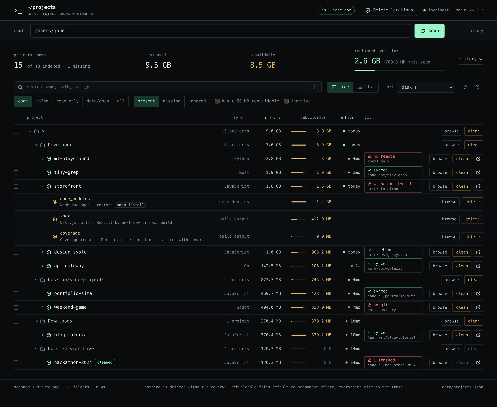

> [!NOTE]
> Currently tested on macOS only. It runs on other systems, but some protections and labels are tuned for macOS, and the page says so.

## Why?

Storage is expensive these days—and, trust me, you'll find a ton of bloated `node_modules` folders in worktrees you never touched, plus projects you forgot still existed.

Slop Finder is a small, dependency-free local dashboard for exactly that. Nothing is ever deleted automatically: you review every deletion first and confirm it yourself.

| | |
|---|---|
| 🗺️ **See where the space went** | Every project under a folder, as a tree that adds up disk use, rebuildable space, and last activity at every level. |
| ♻️ **Know what's safe to throw away** | Each `node_modules`, `.venv`, `target`, `.next`, `Pods`, … is listed with its size and the exact command that brings it back (`pnpm install`, `uv sync`, `cargo build`), picked from the project's lockfile or manifest. |
| 🛡️ **Delete without regret** | Every deletion goes through a review: exact size, what's inside, what Git says about it, and a risk level. Risky items are never pre-selected. |
| 🔀 **Know what's backed up** | A Git chip on every project says whether its work also exists on a remote, and you can commit and push from the dialog before cleaning. |
| 📈 **Watch it add up** | Freed space is recorded as *reclaimed over time*, including space you free outside the app between scans. |
| 🔒 **Stays on your machine** | One `node server.js` on `127.0.0.1`, no dependencies, no sign-up. The inventory is a JSON file next to the app. |

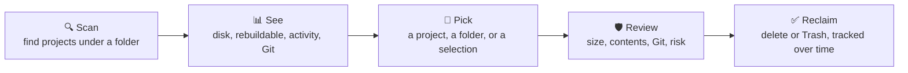

## Quick start

You need **macOS**, **Node.js 20+**, and **Git**. The [GitHub CLI](https://cli.github.com) (`gh`) is optional; it enables commit, push, and live checks against GitHub.

```bash
git clone https://github.com/Rami-0/slop-finder.git
cd slop-finder
npm start
```

There is nothing to install: the app has no dependencies. Open [http://127.0.0.1:4173](http://127.0.0.1:4173), choose a folder (your home folder is a good start), and click **scan**.

The inventory is stored next to the app in `data/projects.json`. That file is intentionally ignored by Git because it contains local paths and project names.

For the Git actions, sign the GitHub CLI in once:

```bash
brew install gh && gh auth login
```

## A quick tour

### The tree

The **tree view** (the default, shown at the top) lays projects out where they live on disk: `~ → Developer → storefront`. Folder chains with a single child collapse into one row (`Desktop/side-projects`). Every folder row adds up the disk use, rebuildable space, and latest activity of the projects beneath it, and its bars compare it with its siblings, so each level shows where its own space goes. When a filter hides a parent but matches something inside it, the parent stays in the tree, dimmed, so nesting is never lost.

| Column | What it tells you |
|---|---|
| **disk** | The allocated size of the whole project folder: source, dependencies, builds, caches, and Git history. It matches what the operating system reports. |
| **rebuildable** | The part tools can recreate: dependencies, build output, and caches. It never includes source files or Git history. |
| **active** | When the project last changed: its newest source file, or its latest commit or checkout, whichever is later. Dependencies, builds, caches, and `.DS_Store` don't count. |
| **git** | Whether the work here also exists somewhere else. See [Git and GitHub](#git-and-github). |

The header shows the system Slop Finder runs on (`macOS 26.6.2`) and whether the GitHub CLI is signed in (`gh · you`).

### Nested projects and restore commands

Expand a project to see its **rebuildable folders**, each with its size and how to get it back. Nested projects (workspace packages, the `ios/` and `android/` apps inside a React Native project) appear inside their parent. Install commands come from the lockfile, including a monorepo root's lockfile for its workspace packages (`pnpm install` here):

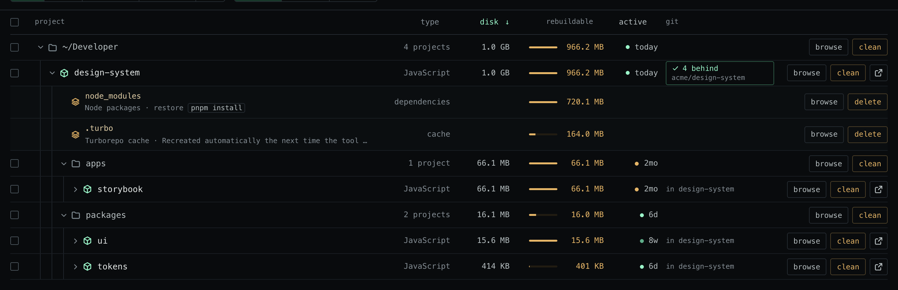

Folders whose names are sometimes used for hand-written files (`vendor`, `build`, `dist`, `out`, `target`) carry a **verify** badge, and the cleanup review checks them against Git before selecting them.

### Finding what to clean

The **active** column is colored by how long a project has been idle:

| Level | Idle for | Dot |
|---|---|---|
| active | under 14 days | mint |
| recent | 14 to 59 days | green |
| idle | 60 to 179 days | amber |
| dormant | 180 days or more | red |

The **inactive** filter keeps idle and dormant projects, which is everything untouched for 60 days or more. Switch to the flat **list view** and sort by **rebuildable ↓**, and you get your cleanup shortlist:

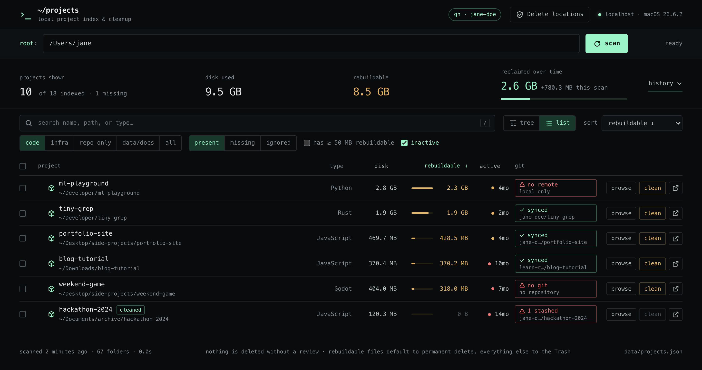

The thresholds live in `LEVEL_STARTS` in [`public/js/activity.js`](public/js/activity.js).

You can also search (press <kbd>/</kbd>), filter by type (code, infra, repo only, data/docs) and status (present, missing, ignored), and ignore entries you never want to see again. Ignored paths stay ignored after future scans and can be restored from the **ignored** filter. The tree works from the keyboard too: <kbd>↑</kbd> <kbd>↓</kbd> move, <kbd>←</kbd> <kbd>→</kbd> collapse and expand, <kbd>Space</kbd> selects, <kbd>Enter</kbd> browses, <kbd>Esc</kbd> clears the selection.

### The folder browser

<table>
<tr>
<td width="46%" valign="top">

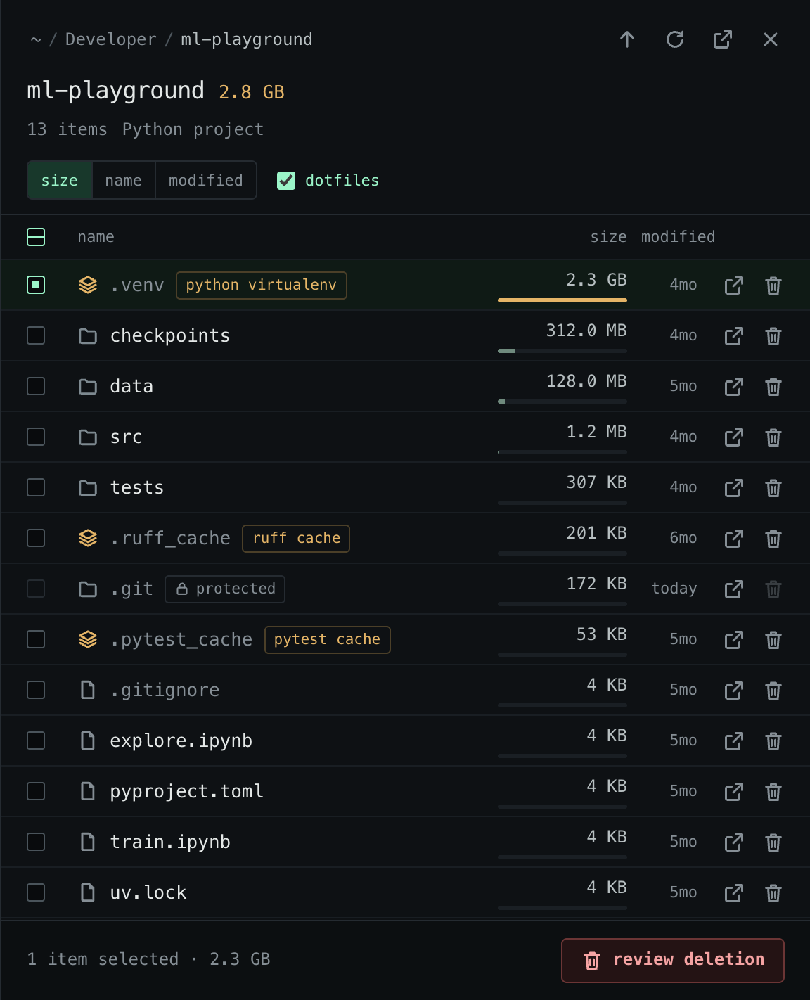

</td>
<td valign="top">

**browse** opens a folder browser beside the tree. It lists any folder's contents with sizes, measured in the background and sorted largest first.

- Rebuildable folders carry a badge (`python virtualenv`, `ruff cache`, …).
- Protected items show a lock with the reason: here, `.git` can't be deleted on its own.
- Select items and **review deletion** sends them through the same review as everything else.
- Folders open in Finder. Files, apps, and installers are only ever *revealed* there, never launched.

</td>
</tr>
</table>

## Cleaning up

Every deletion goes through the same review:

1. **Choose what to clean.** Use **clean** on a project (all its rebuildable folders), **clean** on a folder row (every project beneath it), **delete** on a single rebuildable folder, **review cleanup** on selected projects, or select items in the folder browser.
2. **Review.** For each item the app measures the exact size and file count, and shows what is inside and how to restore it. It asks Git whether the item is ignored (disposable), untracked, or tracked (part of the source). For folders that contain repositories, it reports uncommitted changes, unpushed commits and branches, stashes, and repositories with no remote.
3. **Pick how.** Rebuildable output defaults to **Delete permanently**, which frees the space now. Anything else defaults to **Move to Trash**, which you can undo with Put Back.
4. **Watch it run.** Items are deleted one at a time with progress, and you can stop between items. Partial failures report exactly how much was freed.

<table>
<tr>
<td width="50%" valign="top">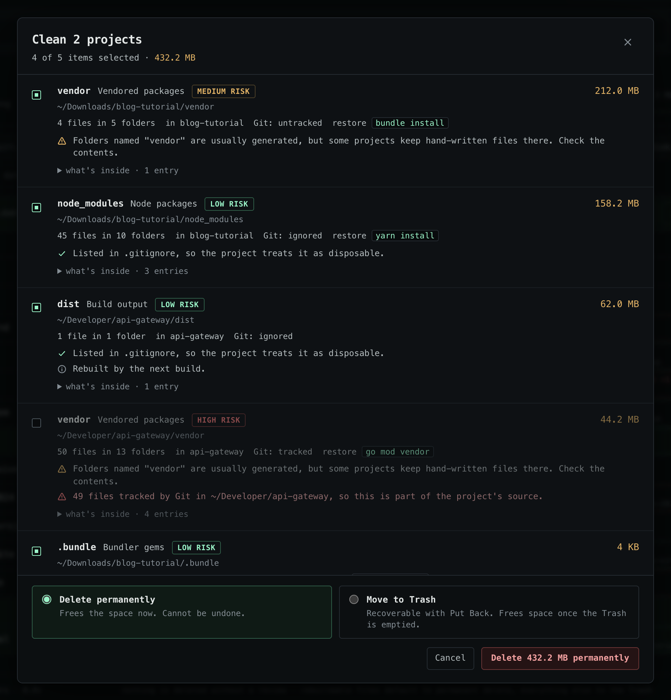</td>
<td width="50%" valign="top">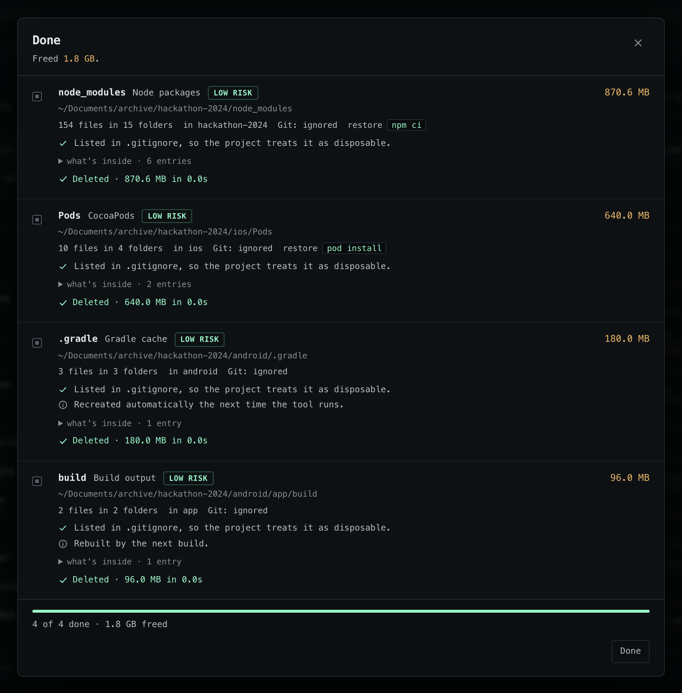</td>
</tr>
<tr>
<td valign="top"><b>Review.</b> The committed <code>vendor/</code> of a Go service is rebuildable by name but tracked by Git, so it is <b>high risk</b> and starts unchecked.</td>
<td valign="top"><b>Done.</b> Four rebuildable folders of a dormant app, each with how it comes back.</td>
</tr>
</table>

Each item gets a risk level:

| Risk | When | Pre-selected |
|---|---|---|
| **low** | Rebuildable output, such as a folder `.gitignore` treats as disposable | yes |
| **medium** | Anything that isn't rebuildable output, or a verify-badge folder that Git doesn't ignore | yes |
| **high** | Files tracked by Git, or a repository inside with uncommitted changes, unpushed commits, stashes, or no remote at all | **no** |

Permanently deleting anything that cannot be rebuilt, or anything rated high risk, requires typing `delete`.

The inventory updates immediately: containing projects shrink, projects inside a removed folder become missing, and the freed space is added to **reclaimed over time**. Scans also compare top-level projects with the previous scan, so space you free outside the app (a folder you deleted in Finder, say) is counted too:

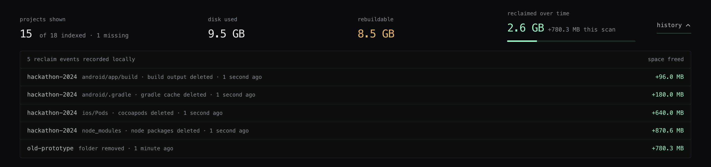

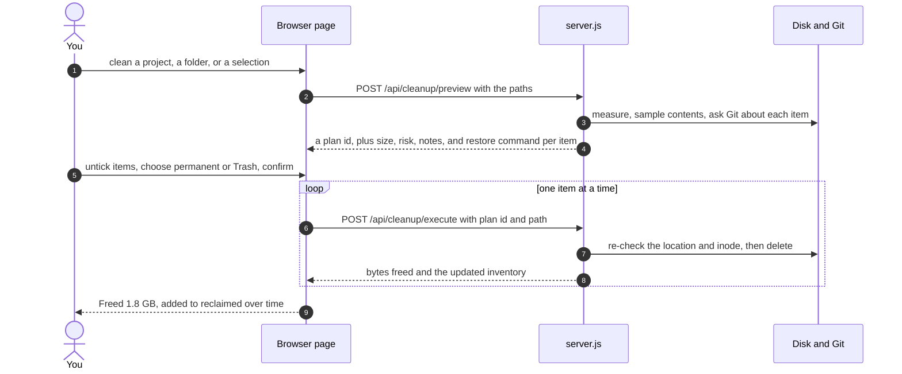

## Git and GitHub

The **git** column answers one question for every project: *would deleting this lose work that exists nowhere else?* It shows the most urgent fact (`no remote`, `4 uncommitted`, `2 unpushed`, `1 stashed`, `synced`, or `no git` for a folder outside any repository) above where the code is pushed (`owner/repo`, `local only`). Its color is the verdict:

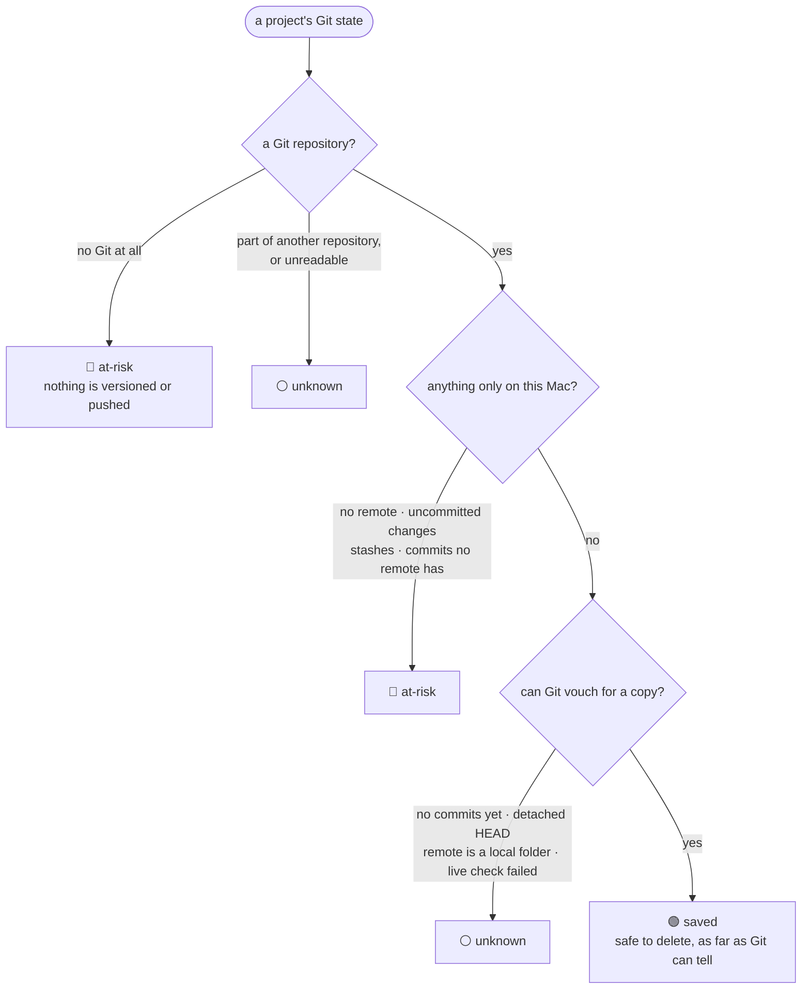

Being *behind* the remote doesn't count against a project: the remote already has everything this Mac has. The policy lives in `gitVerdict()` in [`public/js/git-view.js`](public/js/git-view.js), and the facts it weighs are always shown as text next to it. A deleted project keeps the remote it had when last seen (`was on owner/repo`), with the command to clone it back.

Click a chip for the Git dialog:

<p align="center">
  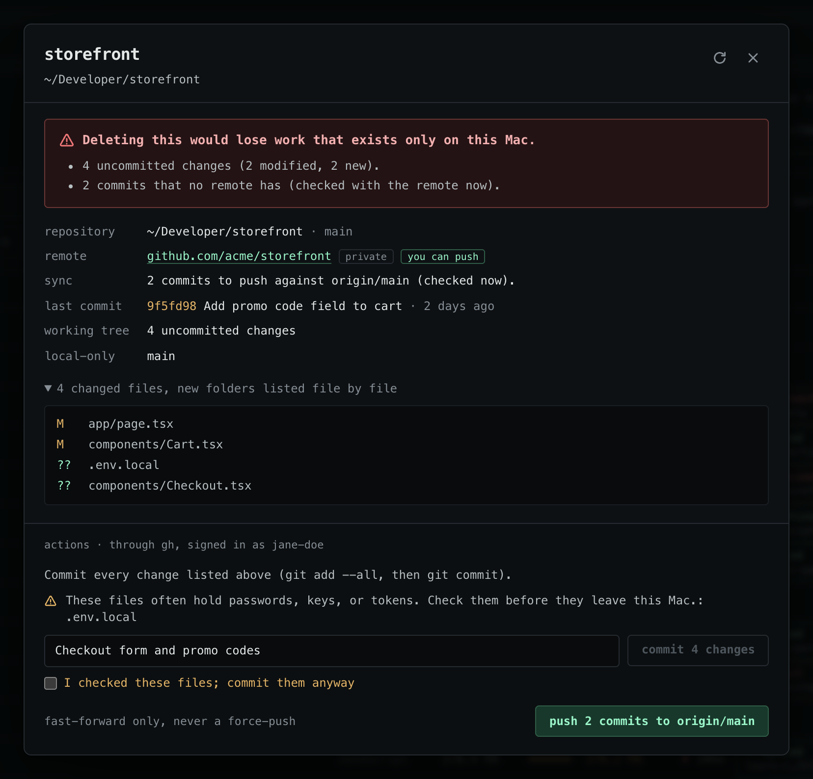
</p>

- **The repository**: its branch, every remote with a link, and, on GitHub, whether it is public or private and whether your account can push.
- **Sync**: whether the branch matches the remote. With the GitHub CLI signed in, Slop Finder asks GitHub directly (`git ls-remote`, which writes nothing), so a branch deleted on GitHub or a stale fetch cannot make work look safe. A commit counts as safe when *any* remote has it. Without gh, the answer is "as of the last fetch", with its date. A live answer is remembered until HEAD, a branch, or a remote-tracking ref moves.
- **What exists only here**: uncommitted changes (every file listed), commits that no remote has, the branches holding them, and stashes (which are never pushed).

**Actions**, all through the GitHub CLI and the session it already holds:

- **Commit** every listed change with a message. The commit is refused if the files changed since you looked, if a rebuildable folder (`node_modules`, `.venv`, …) is about to be committed because `.gitignore` misses it, if more than 5,000 files changed, or if a file is over GitHub's 100 MB limit. Likely secrets (`.env`, `*.pem`, `id_rsa`, `credentials.json`, …) and files over 50 MB need an explicit confirmation. The repository's own hooks run, as they would in a terminal.
- **Push** the current branch, or any other local branch that has commits no remote has. Pushes are fast-forward only: the refspec is explicit, so force-push or mirror settings in a repository's config never apply. If GitHub has commits you don't, the push is refused and you are told to pull first.
- **Create on GitHub** for a repository with no remote: `gh repo create` (private by default, or under an organization with `org/name`), added as `origin`, and pushed.

Slop Finder never reads or stores your token. Each network command gets `gh auth git-credential` as its only credential helper for that one command, and SSH remotes on GitHub are sent over HTTPS for that command so the gh session applies. Nothing is written to any Git config. When gh is not installed or not signed in, the Git facts still show, the actions are hidden, and the dialog says what to run (`gh auth login`).

## Safety

A deletion has to pass every one of these checks, on the server, right before it happens:

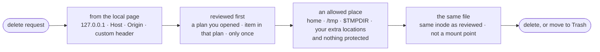

- **Preview is enforced by the server.** Deleting requires the id of a review you opened (valid for 30 minutes). Only items from that review can be deleted, each only once. Right before deleting, the server checks again that the item is allowed and is still the same file on disk (same inode), so something swapped in after the review is refused.
- **Delete locations.** Deletions are allowed only inside your home folder, `/tmp`, and your own temporary folder (`$TMPDIR`). macOS gives every user on every Mac a different `$TMPDIR` (`/private/var/folders/<xx>/<id>/T`), so it is found at runtime and shown by name. Only that `T` folder is allowed: its siblings `C`, `0`, and `X` hold live caches and state for macOS services, and the rest of `/private/var` belongs to the system, so none of it can be added as a location either. To allow a drive or folder outside these (for example `/Volumes/Archive`), add it under **Delete locations**. That list is saved in this browser only, and the server re-validates it on every request.
- **Never deleted:** system folders (`/System`, `/usr`, `/opt/homebrew`, …), `~/Library`, credential folders (`~/.ssh`, `~/.aws`, `~/.config`, …), the Trash, `.git`/`.hg`/`.svn` metadata, mounted volumes, and Slop Finder itself. Your home folder, allowed locations, and standard folders (Desktop, Documents, Downloads, …) can be cleaned inside but never removed whole. Symlinks are removed as links, never followed. Path checks fold case, because APFS is case-insensitive.
- **Other websites can't use it.** The server only listens on `127.0.0.1`. It rejects requests with a foreign `Host` header (DNS rebinding) or `Origin`, and requires a custom header that cross-site pages cannot send without a CORS preflight, which the server never approves. The page cannot be framed, and its content security policy loads nothing from anywhere else.
- **Git is only read** unless you click commit, push, or create. Status checks run with `GIT_OPTIONAL_LOCKS=0`, so they never rewrite a repository's index, and with `core.fsmonitor` off, so a repository's own config cannot make a status check run a program. Remote URLs are shown without any credentials they contain. Only one Git action runs per repository at a time.

## What it recognizes

**Projects.** Git, bare Git, Mercurial, and Subversion repositories, plus the usual project files:

| Kind | Recognized by |
|---|---|
| Code | `package.json`, `deno.json`, `Cargo.toml`, `go.mod`, `pyproject.toml`, `requirements.txt`, `Pipfile`, `uv.lock`, `Gemfile`, `composer.json`, `pom.xml`, `build.gradle`, `Package.swift`, `*.xcodeproj`, `Podfile`, `*.sln`, `*.csproj`, `mix.exs`, `pubspec.yaml`, `CMakeLists.txt`, `meson.build`, `Makefile`, `DESCRIPTION` (R), `Project.toml` (Julia), `rebar.config`, `dune-project`, `stack.yaml`, `build.zig`, `platformio.ini`, `*.ino`, `*.rockspec`, `foundry.toml`, `hardhat.config.*`, Bazel workspaces, and Unity, Unreal, and Godot projects |
| Infrastructure | `Dockerfile`, Compose files, `*.tf`, `Pulumi.yaml`, `Chart.yaml`, `serverless.yml`, `ansible.cfg`, `flake.nix` |
| Docs and data | `mkdocs.yml`, `book.toml`, `_config.yml`, `*.ipynb` |

**Rebuildable folders**, and how they come back:

| Kind | Folders | Restored by |
|---|---|---|
| Dependencies | `node_modules` · `bower_components` · `.venv` · `venv` · `.tox` · `vendor`✱ · `Pods` · `.bundle` · `.dart_tool` · `.terraform` · `deps` (Mix) | the project's installer, picked from its lockfile or manifest: `pnpm install`, `yarn install`, `bun install`, `npm ci`, `uv sync`, `poetry install`, `pipenv install`, `composer install`, `bundle install`, `go mod vendor`, `pod install`, `flutter pub get`, `terraform init`, `mix deps.get` |
| Build output | `dist`✱ · `build`✱ · `out`✱ · `target`✱ · `.next` · `.nuxt` · `.output` · `.svelte-kit` · `.docusaurus` · `storybook-static` · `cdk.out` · `.serverless` · `.aws-sam` · `coverage` · `DerivedData` · `.stack-work` · `zig-out` · `_build` (Mix) · `bin` and `obj` (.NET) | the next build (`cargo build`, `mvn package`, `next build`, …) |
| Caches | `.cache` · `.turbo` · `.parcel-cache` · `.angular` · `.expo` · `.gradle` · `.sass-cache` · `__pycache__` · `.pytest_cache` · `.mypy_cache` · `.ruff_cache` · `.zig-cache` · `Library` (Unity) · `.godot` | the tool itself, the next time it runs |

✱ These names are sometimes used for hand-written files, so they carry a **verify** badge.

Generated and dependency folders are skipped during project *discovery*, so their internal manifests do not create false projects (every package in `node_modules` has a `package.json`). They are still fully counted when measuring disk usage. Hidden folders are not searched for projects, and discovery goes up to eight levels deep. When scanning from `/`, operating-system and package-manager trees (`/System`, `/usr`, `/opt/homebrew`, …) are skipped. macOS mirrors `/Users` into `/System/Volumes/Data`, so walking it would list every project twice.

## Configuration

```bash
PORT=8080 npm start                          # a different port (default 4173)
SLOP_FINDER_DATA_DIR=/tmp/sandbox npm start  # a separate inventory, for experiments
```

## Under the hood

A plain `node:http` server and a page built from native ES modules. There is no framework, no bundler, and no `node_modules` of its own.

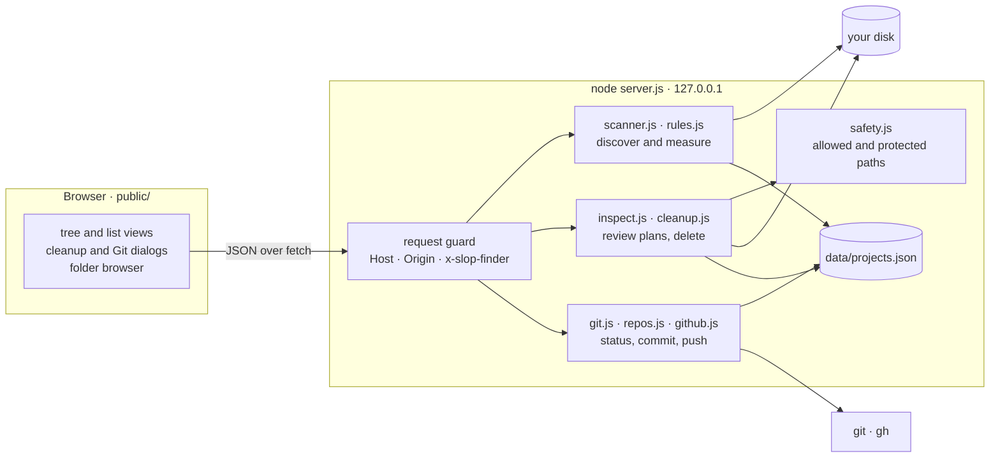

A few choices that keep it simple and safe:

- **One walk per project.** `directoryBreakdown()` visits each file once and sorts its allocated bytes into source, dependencies, build output, caches, and Git metadata, while recording every rebuildable folder, nested repository, and the newest source change.
- **Plans, not paths.** The page can never ask to delete a path directly, only an item from a review plan the server created, and each item can run once.
- **One writer at a time.** Scans, deletions, and Git snapshots read, modify, and write the same JSON file through a promise queue, and every write goes to a temporary file that is then renamed into place, so a crash can't leave half an inventory.
- **Facts first, verdicts second.** The server reports raw Git facts. Two small browser functions turn them into colors: `gitVerdict()` for the git column and `activityLevel()` for the active column.

<details>
<summary><b>Project layout</b></summary>

```text
slop-finder/
├── server.js            HTTP server: security headers, request guard, JSON routes, static files
├── lib/
│   ├── scanner.js       project discovery, disk breakdown, reclaim tracking
│   ├── rules.js         project markers, rebuildable-folder rules, restore commands
│   ├── inspect.js       folder browser, measuring, cleanup risk assessment
│   ├── cleanup.js       review plans and one-item-at-a-time deletion
│   ├── safety.js        allowed locations and protected paths
│   ├── git.js           read-only Git plumbing, commit, fast-forward push
│   ├── repos.js         Git state for indexed projects and the actions allowed on them
│   ├── github.js        GitHub CLI session, repository info, gh repo create
│   ├── store.js         the JSON inventory: atomic writes, one change at a time
│   ├── config.js        host, port, data directory
│   ├── system.js        which OS the server runs on
│   └── paths.js, limit.js   path helpers and a small concurrency limiter
├── public/
│   ├── index.html, styles.css
│   └── js/              one module per piece: tree, list rows, dialogs, folder browser, verdicts
├── test/                node:test suites
├── docs/screenshots/    the images in this README
└── data/projects.json   your inventory (ignored by Git)
```

</details>

<details>
<summary><b>HTTP API</b></summary>

Every API request needs the header `x-slop-finder: 1`, and every `POST` a JSON body. Requests from other origins are refused.

| Method | Endpoint | What it does |
|---|---|---|
| `GET` | `/api/projects` | The inventory, with present and missing projects refreshed |
| `POST` | `/api/scan` | Scan a folder: `{ root }` |
| `POST` | `/api/ignore` | Ignore or restore entries: `{ paths, ignored }` |
| `POST` | `/api/open` | Open a folder, or reveal an item, in Finder |
| `POST` | `/api/browse` | List a folder for the folder browser |
| `POST` | `/api/measure` | Measure one folder |
| `GET` | `/api/locations` | Built-in and protected locations |
| `POST` | `/api/locations/validate` | Check a folder before adding it as a delete location |
| `POST` | `/api/cleanup/preview` | Create a review plan for some paths |
| `POST` | `/api/cleanup/execute` | Delete one item of a plan: `{ planId, path, mode }` |
| `GET` | `/api/system` | The OS name and version |
| `GET` | `/api/github/status` | The gh session (`?fresh=1` checks again) |
| `POST` | `/api/git/overview` | Git state for many projects |
| `POST` | `/api/git/details` | Full Git state for one project, with a live remote check |
| `POST` | `/api/git/commit` | Commit the reviewed changes |
| `POST` | `/api/git/push` | Push a branch, fast-forward only |
| `POST` | `/api/github/create` | Create the GitHub repository and push |

</details>

## Tests

```bash
npm test
```

The suite uses the built-in `node:test` runner and covers discovery and measuring, the delete-location and protection rules, cleanup plans (including an item swapped after its review), Git state and the commit and push guards, the Git verdict, and the activity levels. The cleanup tests use a temporary inventory and temporary folders; they never touch `data/projects.json`. The browser modules are tested straight from `public/js` through Node's ES-module syntax detection, which may print a harmless `MODULE_TYPELESS_PACKAGE_JSON` warning.

## FAQ

<details>
<summary><b>Is deleting <code>node_modules</code> (or <code>.venv</code>, <code>target</code>, …) really safe?</b></summary>

For folders your tools recreate, yes: that is what "rebuildable" means, and each one lists the command that brings it back. The review still asks Git about every item. A folder that Git tracks (a committed `vendor/`, for example) is marked high risk and left unchecked.
</details>

<details>
<summary><b>Why is "rebuildable" smaller than "disk"?</b></summary>

Disk counts everything in the folder, including your source, assets, datasets, model checkpoints, and Git history. Rebuildable counts only what tools can recreate.
</details>

<details>
<summary><b>Can I undo a cleanup?</b></summary>

**Move to Trash** can be undone with Put Back in Finder; it frees the space once the Trash is emptied. **Delete permanently** can't be undone, which is why it is the default only for rebuildable output, and why anything else needs you to type `delete`.
</details>

<details>
<summary><b>Does anything leave my machine?</b></summary>

Your files and the inventory stay local, and the page loads nothing from the internet. The only network traffic is `git` and `gh` talking to GitHub: checking the gh session, and, when you open a project's Git dialog, asking GitHub read-only what it has. Commit, push, and create run only when you click them.
</details>

<details>
<summary><b>Why macOS only?</b></summary>

The protected paths, the `$TMPDIR` handling, the Trash integration (`/usr/bin/trash` on macOS 15+, Finder before that), and the Finder labels are tuned for macOS. On other systems the app runs and says plainly that it is untested there.
</details>

---

<sub>Screenshots show a generated demo home folder with made-up projects and a stand-in GitHub account. No real projects or accounts appear in them.</sub>
